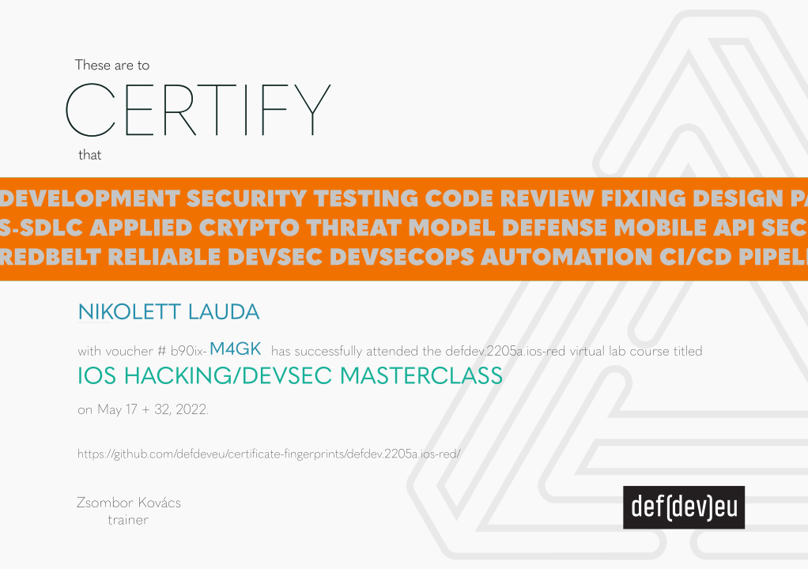

# Fingerprints/digests of the learners' certificates issued by def.dev

This repo holds SHA256 digests of pdf certificates issued in the (printable) format illustrated below.  
(Validation of the 'looney tunes' styled badges does not belong here.)  
(Learners' PII is not present in this public repo.)  

### Steps to locate your hash:
* There is a unique voucher code on your certificate. Like on the below illustration it's b90ix-m4gk. So grepping the repo for your code is the shortcut lookup. OR: 
* Identify the folder that corresponds with your course event. A reminder regarding the defdev's usual folder naming: 2205 means May 2022 (events of April and June might also have been coded as 2205); blue is the color of the standard devsec courses. Nevertheless, usually the exact matching folder name is indicated on the cert, like defdev.2205a.ios-red.
* Alternatively if you take a look at your voucher code shown on the certificate then the first part of it is the code of the course event. Like on the below illustration it's b90ix. So the folder with files containing this event code is the one.
* Locate the file where the trailing 4 chars of its name match the unique voucher code shown on your certificate. Like on the illustration below it was m4gk.
* The name of the sha256 file also indicates the certified achievement (attendance, exam, successful lab work), and the subject of the course, like ios-red means an iOS hacking/devsec masterclass.

### Validation
* Running 'openssl dgst' or 'shasum -a 256' against the pdf should output the same hash/fingerprint/digest as published in the corresponding file.

### Illustration

### Notes
* The content of the folders is signed by a defdev representative, see the asice files.
* The '-' in the sha256 files is the missing name of the signed file.